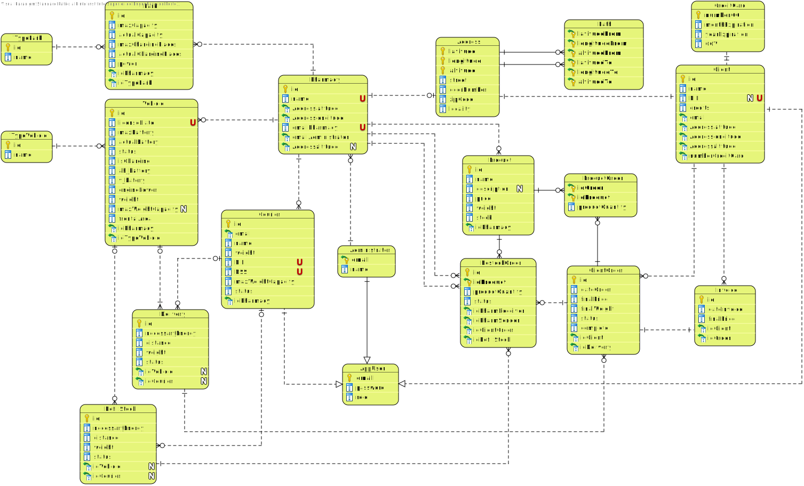

# Engineering Design

## Relational Model (Normalised)

## Class Diagram (CD) and Sequence Diagram (SD)

| Use Case | Description                                                  |
| -------- | ------------------------------------------------------------ |
| UC1      | [Register on the System](UC1/UC1_RegisterUser_Design.md)     |
| UC2      | [Login](UC2/UC2_Design)                                      |
| UC3      | [Create Pharmacy](UC3_Design.md)                             |
| UC4      | [Add Courier](UC4/UC4_AddCourier_Design.md)                  |
| UC5      | [Remove Courier](UC5/UC5_RemoveCourier_Design.md)            |
| UC6      | [Add Vehicle](UC6/UC6_AddVehicle_Design.md)                  |
| UC7      | [Remove Vehicle](UC7/UC7_RemoveVehicle_Design.md)            |
| UC8      | [Add Medicine](UC8/UC8_AddMedicine_Design.md)                |
| UC9      | [Remove Medicine](UC9/UC9_RemoveMedicine_Design.md)          |
| UC10     | [Create Restock Order](UC10/UC10_CreateRestockOrder_Design.md) |
| UC11     | Create Restock Delivery Run                                  |
| UC12     | [Add to Cart](UC12/UC12_AddToCart_Design.md)                 |
| UC13     | [Remove from Cart](UC13/UC13_RemoveProductFromCart_Design.md) |
| UC14     | [Checkout](UC14/UC14_Checkout_Design.md)                     |
| UC15     | [Pickup Order](UC15/UC15_PickUpOrder_Design.md)              |
| UC16     | [Pickup Scooter](UC16/UC16_PickUpTheEletricScooter_Design.md) |
| UC17     | [Park Scooter](UC17/UC17_ParkTheScooter_Design.md)           |
| UC18     | Park Drone                                                   |
| UC19     | [Create Order Delivery Run](UC19/UC19_CreateOrderDeliveryRun_Design.md) |

