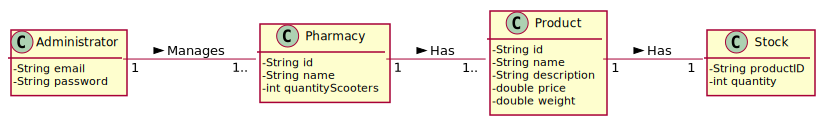
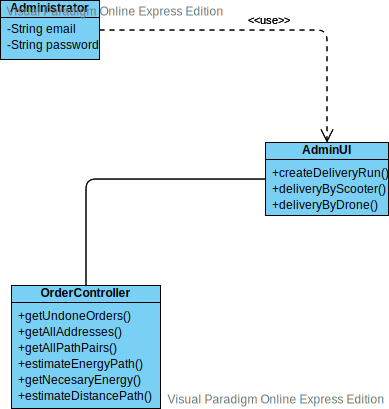

# UC 11 - Remove Medicine

## 1. Requirements Engineering

### Brief Format

The Administrator chooses to remove a medicine from the system. The system asks for the id of the medicine to be removed. The administrator writes the id. The System shows the medicine to be deleted and asks for confirmation. The Administrator confirms. The System removes the medicine and informs about the success of the operation.

### SSD

### Full Format

#### Main Actor

Administrator

#### Stakeholders and their interests

* **Administrator:** want to delete medicines that are no longer sold by the pharmacy 
* **Pharmacy:** intends to have the medicines updated.

#### Preconditions

The Pharmacy has to be registered in the platform.

The medicine has to be registered in the system.

#### Post-conditions

The medicine should be removed from the system.

#### Main success scenario (or basic flow)

1. The Administrator chooses to remove a medicine from the system.
2. The system asks for the id of the medicine to be removed. 
3. The administrator writes the id. 
4. The System shows the medicine to be deleted and asks for confirmation. 
5. The Administrator confirms.
6. The System removes the medicine and informs about the success of the operation.

#### Extensions (or alternative flow)

*a. The Administrator requests to cancel the removing of a medicine

> The use case ends.

4. The system detects that the id entered is invalid.

> 1. The system alerts the administrator to the fact.
> 2. The system allows its modification (step 3).
>
    > 2a.  The Administrator does not change the data. The use case ends.

-----------------

## 2. OO Analysis

### Excerpt from the Relevant Domain Model for UC

## 3. Design - Use Case Realization

###	Sequence Diagram

###	Class Diagram

