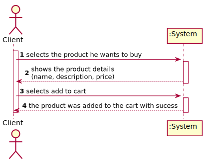
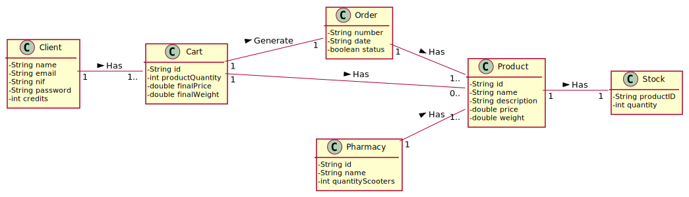

# UC 12 - Add to Cart

## 1. Requirements Engineering

### Brief Format

The Client selects the product he wants to buy. The system shows the product details (name, description, price). The client selects add to cart. The System informs about the success of the operation.

### SSD

### Full Format

#### Main Actor

Client

#### Stakeholders and their interests

* **Client:** want to by medicines.
* **Pharmacy:** intends to sell medicines.

#### Preconditions

The Pharmacy has to be registered in the platform.

The Client has to be login in the platform.

#### Post-conditions

The medicine is added to the cart.

#### Main success scenario (or basic flow)

1. The Client selects the product he wants to buy. 
2. The system shows the product details (name, description, price).
3. The client selects add to cart. 
6. The System registers the data and informs about the success of the operation.

#### Extensions (or alternative flow)

*a. The Administrator requests to cancel the adding of a medicine to cart

> The use case ends.

-----------------

## 2. OO Analysis

### Excerpt from the Relevant Domain Model for UC

## 3. Design - Use Case Realization

###	Sequence Diagram

###	Class Diagram

