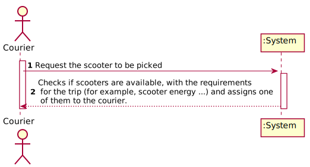

# UC 16 - Pick up the Electric Scooter

## Requirement Engineering

### Brief format
The Courier request the scooter to be picked. The system checks if scooters are available and with the requirements for the trip (for example, scooter energy ...) and assigns one of them to the courier.

### SSD

### Full Format

#### Main Actor

Courier

#### Stakeholders and their interests
**Client**: wants that the courier pick his scooter to do the delivery of the client in question.

**Courier**: wants to pick up one scooter to do the delivery. 

**Administrator**: wants that the couriers of his pharmacy pick up them scooters to ask the deliveries requested.

#### Preconditions

Its necessary that the courier has orders previously.

#### Postconditions
A scooter available is assigned to the courier.

#### Main success scenario

1. The Courier requests one scooter to be picked.
2. The system checks if have scooters available and with the requirements for the trip (for example, scooter energy ...) and assigns one of them to the courier.

#### Extensions

*a. The Courier cancels the request of the scooter.
> The use case ends.

2a. The system does not have scooters available.
>  The system informs the courier .The use case ends.

2b. The system have scooters available but they don't correspond to the requirements to the trip
>  The system informs the courier .The use case ends.
