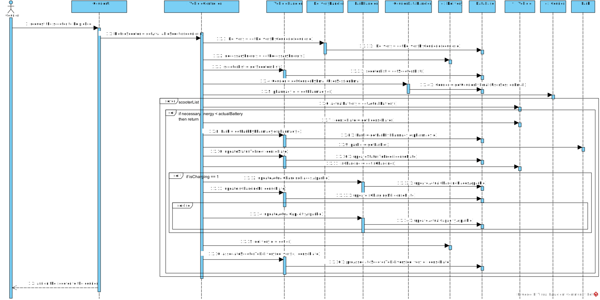

# UC 16 - Pick up the Eletric Scooter

## Design - Realização do Caso de Uso

### Racional

| Main Flux | Question: Which class... | Answer  | Justification  |
|:--------------  |:---------------------- |:----------|:---------------------------- |
|1. The Courier request the scooter to be picked |... interacts with te Courier?| PickUpTheEletricScooterUI |Pure Fabrication|
| |... coordinates the UC?| PickUpTheEletricScooterController |Controller|
|2. The system checks if scooters are available and with the requirements for the trip (for example, scooter energy ...) and assigns one of them to the courier.|...has the list of scooters?| Pharmacy| |
|  |...knows the requirements? | Delivery | |
|  |...knows the requirements? | Delivery | |

### Sistematization ##

From the racional, the conceptual classes that are promoted to software classes are:

 * Pharmacy
 * Delivery
 * EletricScooter

Other software classes (eg: Pure Fabrication) identified:

 * PickUpTheEletricScooterUI
 * PickUpTheEletricScooterController

### Sequence Diagram

### Class Diagram

