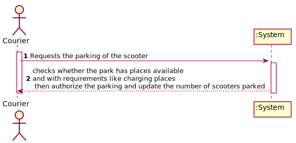
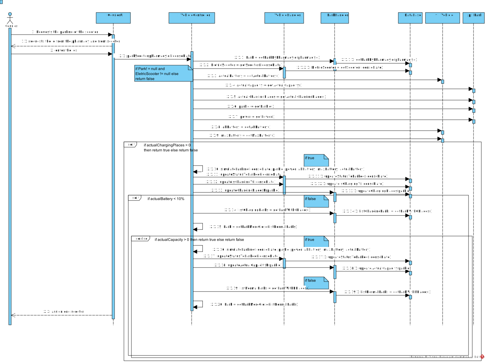

# UC 17 - Park the scooter

## 1.Requirement Engineering

### Brief format
The courier requests the parking of the scooter.The system request the id from the pharmacy to park and from scooter. The courier enter the data(ids). The system validates the data, checks whether the park has places availables and with requirements like charging places then authorize the parking and update the number of scooters parked.

### SSD

### Full Format

#### Main Actor

Courier

#### Stakeholders and their interests

**Courier**: wants to park the scooter to finalize his delivery.

**Administrator**: wants that the couriers park the scooters of his pharmacy.

#### Preconditions

Its necessary that the courier has one scooter with him.

#### Postconditions
A scooter is parked.

#### Main success scenario

1. The courier requests the parking of the scooter.
2. The system request the id from the pharmacy to park and from scooter.
3. The courier enter the data(ids).
4. The system validates the data, checks whether the park has places availables 
and with requirements like charging places then authorize the parking and update the number of scooters parked.

-----------

#### Extensions

*a. The Courier cancels the parking of the scooter.
> The use case ends.

2a. The park don't have free palces
>  The system informs the courier .The use case ends.

#### Special requirements
\-

#### Lista of Data and Techonology variation
\-

#### Frequency of Occurence

Everytime that the courier finish one delivery.

#### Open Questions

## 2. Object oriented analysis

### Excerpt from the Relevant Domain Model for UC

## 3. Design - Realização do Caso de Uso

### Sequence Diagram

### Class Diagram

