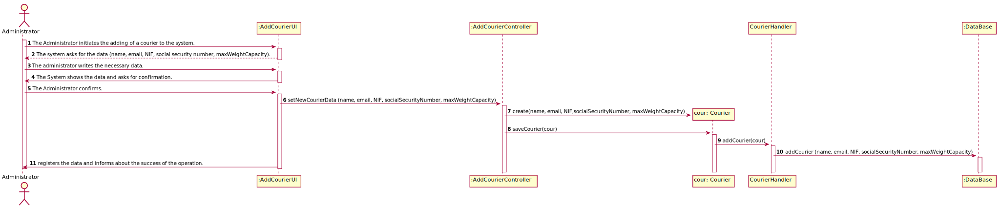

# UC 4 - Add Courier

## 1. Requirements Engineering

### Brief Format

The Administrator initiates the adding of a courier to the system. The system asks for the data (name, email, NIF, social security number). The administrator writes the necessary data. The System shows the data and asks for confirmation. The Administrator confirms. The System registers the data and informs about the success of the operation.

### SSD

### Full Format

#### Main Actor

Administrator

#### Stakeholders and their interests

* **Administrator:** want to register couriers so that the pharmacy can do deliveries
* **Courier:** wants to do the deliveries.
* **Pharmacy:** intends to pay to couriers and sell medicines.

#### Preconditions

The Pharmacy has to be registered in the platform.
The Courier that will be added shouldn't exist in the platform.

#### Post-conditions

The Courier should be added to the system.

#### Main success scenario (or basic flow)

1. The Administrator initiates the adding of a courier to the system.
2. The system asks for the data (name, email, NIF, social security number).
3. The administrator writes the necessary data. 
4. The System shows the data and asks for confirmation.
5. The Administrator confirms.
6. The System registers the data and informs about the success of the operation.

#### Extensions (or alternative flow)

*a. The Administrator requests to cancel the adding of a courier

> The use case ends.

4a. Missing minimum required data.
>    1. The system informs you which data is missing.
>    2. The system allows the entry of missing data (step 3)
>
    >    2a. The Collaborator does not change the data. The use case ends.

4b. The System detects that the data (or some subset of the data) entered must be unique and that it already exists in the system.
>    1. The system alerts the collaborator to the fact.
>    2. The system allows its modification (step 3)
>
    >    2a.  The Collaborator does not change the data. The use case ends.

4c. The system detects that the data entered (or some subset of the data) is invalid.
> 1. The system alerts the collaborator to the fact.
> 2. The system allows its modification (step 3).
>
    > 2a.  The Collaborator does not change the data. The use case ends.

#### Special Requirements

--------------------

#### List of Technologies and Data Variations

-------------------

#### Frequency of Occurrence

------------------

#### Open questions

-----------------

## 2. OO Analysis

### Excerpt from the Relevant Domain Model for UC

## 3. Design - Use Case Realization

### Rational

| Main Flow | Question: Which Class ... | Answer  | Justification  |
|:--------------  |:---------------------- |:----------|:---------------------------- |
| 1. The Administrator initiates the adding of a courier to the system. 		 | ...interacts with the user?						   |   AddCourierUI          |       Pure Fabrication     |
|                                                                                | ...coordinates the UC?                              | AddCourierController    | Controller |
|                                                                                | ...creates Courier instance?                        | CourierHandler                 | Creator (Rule1) |
| 2. The system asks for the data (name, email, NIF, social security number).    | ...interacts with the user?	                       |   AddCourierUI            |   Pure Fabrication    |
| 3. The administrator writes the necessary data.                                | ...stores the data entered?                         | Courier                | instance created in step 1: it has its own data.                              |
| 4. The System shows the data and asks for confirmation.		                 |	...validates the Courier data (local validation)?  |    Courier             |  IE:has its own data.                            |
|                                                                                | ...validates the Courier data (global validation)?  | CourierHandler               | IE:CourierHandler has the data about all couriers  |
| 5. The Administrator confirms.	                                             | 							                           |                        |                                 |
| 6. The System registers the data and informs about the success of the operation.  |	...keeps the created Courier?		 |  CourierHandler    | IE:the CourierHandler contains all the Courier  |

### Systematization ##

 From the rational the classes that are upgraded into software classes are:

 * Courier

 Other software classes (i.e. Pure Fabrication) identified:

 * AddCourierUI
 * AddCourierController
 * CourierHandler
 
 Other classes of external systems / components:

###	Sequence Diagram

###	Class Diagram

