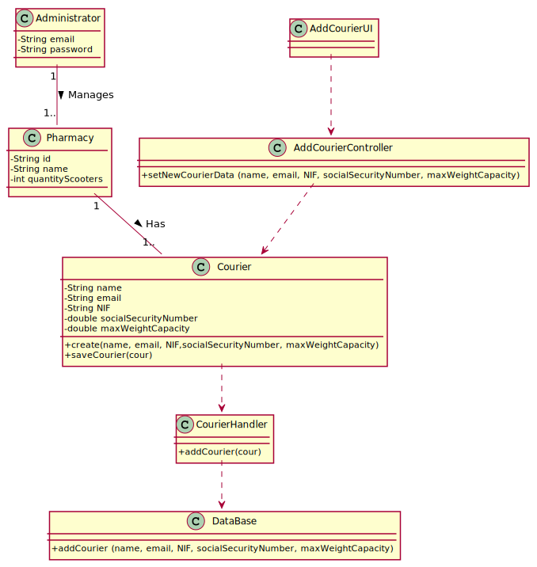

# UC 4 - Add Courier

## Design - Use Case Realization

### Rational

| Main Flow | Question: Which Class ... | Answer  | Justification  |
|:--------------  |:---------------------- |:----------|:---------------------------- |
| 1. The Administrator initiates the adding of a courier to the system. 		 | ...interacts with the user?						   |   AddCourierUI          |       Pure Fabrication     |
|                                                                                | ...coordinates the UC?                              | AddCourierController    | Controller |
|                                                                                | ...creates Courier instance?                        | CourierHandler                 | Creator (Rule1) |
| 2. The system asks for the data (name, email, NIF, social security number).    | ...interacts with the user?	                       |   AddCourierUI            |   Pure Fabrication    |
| 3. The administrator writes the necessary data.                                | ...stores the data entered?                         | Courier                | instance created in step 1: it has its own data.                              |
| 4. The System shows the data and asks for confirmation.		                 |	...validates the Courier data (local validation)?  |    Courier             |  IE:has its own data.                            |
|                                                                                | ...validates the Courier data (global validation)?  | CourierHandler               | IE:CourierHandler has the data about all couriers  |
| 5. The Administrator confirms.	                                             | 							                           |                        |                                 |
| 6. The System registers the data and informs about the success of the operation.  |	...keeps the created Courier?		 |  CourierHandler    | IE:the CourierHandler contains all the Courier  |

### Systematization ##

 From the rational the classes that are upgraded into software classes are:

 * Courier

 Other software classes (i.e. Pure Fabrication) identified:

 * AddCourierUI
 * AddCourierController
 * CourierHandler

 Other classes of external systems / components:

###	Sequence Diagram

###	Class Diagram

