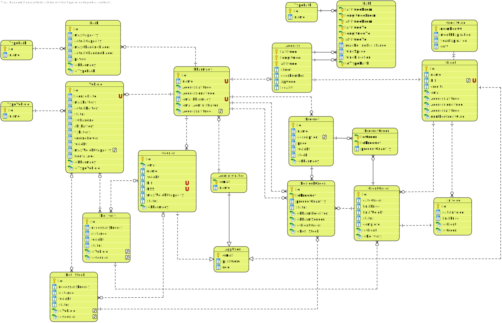

# LAPR3 - G33 - 2020/2021

This repository contains didactic artefacts related to the project being developed in the Course Unit LAPR3 edition of 2020-2021 of [Licenciatura em Engenharia Informática (LEI)](http://www.isep.ipp.pt/Course/Course/26) from [Instituto Superior de Engenharia do Porto (ISEP)](http://www.isep.ipp.pt).


#### Table of contents:

* Project Assignment
* Software Engineering
* Report
* Java source files
* Maven Files
* Notes
* Oracle Repository

# Project Assignment

* [Project Assignment ](LAPR3 - Project Assignment [2020-2021] v2.1.pdf)

  

# Software Engineering 

## Requirements Engineering

### Use Case Diagram


## System Sequence Diagram (SSD)

| Use Case | Description                                                  |
| -------- | ------------------------------------------------------------ |
| UC1      | [Register on the System](Documents/UC1/UC1_RegisterUser.md)  |
| UC2      | [Login](Documents/UC2/UC2_Login.md)                          |
| UC3      | [Create Pharmacy](Documents/UC3_CreatePharmacy.md)           |
| UC4      | [Add Courier](Documents/UC4/UC4_AddCourier.md)               |
| UC5      | [Remove Courier](Documents/UC5/UC5_RemoveCourier.md)         |
| UC6      | [Add Vehicle](Documents/UC6/UC6_AddVehicle.md)               |
| UC7      | [Remove Vehicle](Documents/UC7/UC7_RemoveVehicle.md)         |
| UC8      | [Add Medicine](Documents/UC8/UC8_AddMedicine.md)             |
| UC9      | [Remove Medicine](Documents/UC9/UC9_RemoveMedicine.md)       |
| UC10     | [Create Restock Order](Documents/UC10/UC10_CreateRestockOrder.md) |
| UC11     | [Create Restock Delivery Run](Documents/UC11/UC11_CreateRestockDeliveryRun.md) |
| UC12     | [Add to Cart](Documents/UC12/UC12_AddToCart.md)              |
| UC13     | [Remove from Cart](Documents/UC13/UC13_RemoveProductFromCart.md) |
| UC14     | [Checkout](Documents/UC14/UC14_Checkout.md)                  |
| UC15     | [Pickup Order](Documents/UC15/UC15_PickUpOrder.md)           |
| UC16     | [Pickup Scooter](Documents/UC16/UC16_PickUpTheEletricScooter.md) |
| UC17     | [Park Scooter](Documents/UC17/UC17_ParkTheScooter.md)        |
| UC18     | [Park Drone](Documents/UC18/UC18_ParkTheDrone.md)            |
| UC19     | [Create Order Delivery Run](Documents/UC19/UC19_CreateOrderDeliveryRun.md) |


## Engineering Analysis

### Domain Model 


## Engineering Design

### Relational Model (Normalised)




## Class Diagram (CD) and Sequence Diagram (SD)

| Use Case | Description                                                  |
| -------- | ------------------------------------------------------------ |
| UC1      | [Register on the System](Documents/UC1/UC1_RegisterUser_Design.md) |
| UC2      | [Login](Documents/UC2/UC2_Design)                            |
| UC3      | [Create Pharmacy](Documents/UC3_Design.md)                   |
| UC4      | [Add Courier](Documents/UC4/UC4_AddCourier_Design.md)        |
| UC5      | [Remove Courier](Documents/UC5/UC5_RemoveCourier_Design.md)  |
| UC6      | [Add Vehicle](Documents/UC6/UC6_AddVehicle_Design.md)        |
| UC7      | [Remove Vehicle](Documents/UC7/UC7_RemoveVehicle_Design.md)  |
| UC8      | [Add Medicine](Documents/UC8/UC8_AddMedicine_Design.md)      |
| UC9      | [Remove Medicine](Documents/UC9/UC9_RemoveMedicine_Design.md) |
| UC10     | [Create Restock Order](Documents/UC10/UC10_CreateRestockOrder_Design.md) |
| UC11     | [Create Restock Delivery Run](Documents/UC11/UC11_CreateRestockDeliveryRun_Design.md) |
| UC12     | [Add to Cart](Documents/UC12/UC12_AddToCart_Design.md)       |
| UC13     | [Remove from Cart](Documents/UC13/UC13_RemoveProductFromCart_Design.md) |
| UC14     | [Checkout](Documents/UC14/UC14_Checkout_Design.md)           |
| UC15     | [Pickup Order](Documents/UC15/UC15_PickUpOrder_Design.md)    |
| UC16     | [Pickup Scooter](Documents/UC16/UC16_PickUpTheEletricScooter_Design.md) |
| UC17     | [Park Scooter](Documents/UC17/UC17_ParkTheScooter_Design.md) |
| UC18     | [Park Drone](Documents/UC18/UC18_ParkTheDrone_Design.md)     |
| UC19     | [Create Order Delivery Run](Documents/UC19/UC19_CreateOrderDeliveryRun_Design.md) |


# Report

### Abstract

### Introduction

The purpose of this project was to develop an application that supports the delivery of pharmaceutical products. In order to do that, the administrator controls the main features of the app, managing the pharmacies, the couriers, the vehicles and the medicines on the system, as well as the deliveries.

This project was implemented in Java, adopting a Test-Driven-Development approach and following an agile methodology (SCRUM). Before starting the implementation of the software, we started by analysing carefully the project assignment and writing down every user story as tasks in the product backlog on Jira (a tool to monitor the development of projects). Each user story was estimated, prioritized and divided into subtasks (Analysis, Design, Implementation and Review). Only the user stories with the highest priority became part of the sprints and consequently divided by the team members to be implemented.

After concluding the analysis, we were required to apply the knowledge acquired in the unit courses of this semester (Computer Architecture, Database, Information Structures, and Applied Physics) to develop a fully functional software.

The following  report will contain a brief summary of the solution implemented and a conclusion summarizing the work done on the past three weeks.

### Solution

The software can be approached from the perspective of three main users: the Administrator, the Courier and the Client.

#### User

To use the application all users have to:

* Login in the Application

#### Administrator

An administrator can manage the pharmacies, the couriers, the vehicles, the medicines and the deliveries on the system , he can:

**Pharmacies**

* Add Pharmacy

When the administrator adds a Pharmacy he can choose to add a Park for Electric Scooters, for Drones or for both.

**Couriers**

* Add Courier
* Remove Courier

When the administrator adds a Courier he is associated with the pharmacy he will work for. When the administrator removes a Courier everything associated with him is removed from the database.

**Electric Scooters/ Drones**

* Add Vehicle
* Remove Vehicle

When the administrator adds a Vehicle he has to choose if he wants to add an Electric Scooter or a Drone. When the administrator removes a Vehicle everything associated with it is removed from the database.

**Medicines**

* Add Medicine
* Remove Medicine

When the administrator removes a Medicine everything associated with it is removed from the database.

**Deliveries**

* Create Restock Orders Delivery 
* Create Client Orders Delivery 

When the administrator creates a delivery run he has to choose the Pharmacy he wants. If the Pharmacy doesn't have client/restock orders to be delivered a info message is issued. The system calculates the shortest path and the one that uses the least energy, giving the administrator the option to choose. The vehicle is assigned accordingly.

#### Courier

A courier can only do deliveries, he can:

**Deliveries**

* Pickup Order
* Pickup Scooter
* Park Scooter

When the courier is assigned to multiple deliveries he can choose the delivery he wants to do first. The system assign the electric scooter to be used. When he proceeds to park the scooter the assignment of the parking space to park the vehicle is done by the system taking into account if there are available charging places.

#### Client

A client can only do orders, he can:

**Orders**

* Add to Cart
* Remove from Cart
* Checkout

When the client removes a product from the cart the total quantity is removed. The client can choose to pay with credits when they are sufficient to cover the total cost of the order.

#### System

* Send e-mails
* Generate invoice
* Add Restock Order
* Add credits
* Generate delivery path
* Calculate necessary energy
* Estimate charge time
* Park Drone

The invoice is automatically generated and sent by e-mail when the order and the payment are successfully completed. When an order isn't complete because a product is out of stock the system automatically verify if any of the nearby pharmacies have that product available and create a restock order and an e-mail is sent to the client informing him. The application supports a credits system that rewards the client for using the home delivery system. For each 5€ spent the client earns 1 credit. For each delivery run created the system generates a path from the pharmacy, go through all the addresses of clients to receive orders and return to the pharmacy. The system calculates the necessary energy to do the delivery to ensure that  chooses a vehicle that has enough energy. When a courier park an electric scooter the system estimates the charging time and sends an e-mail informing the courier. The drone parks itself so the estimate charging time is send to the administrator.

### Tests


### Conclusion

### References


# Java source files

Java source and test files are located in folder src.

# Maven file

Pom.xml file controls the project build.

# Notes
In this file, DO NOT EDIT the following elements:

* groupID
* artifactID
* version
* properties

Beside, students can only add dependencies to the specified section of this file.

## Eclipse files

The following files are solely used by Eclipse IDE:

* .classpath
* .project

## IntelliJ Idea IDE files

The following folder is solely used by Intellij Idea IDE :

* .idea

## How was the .gitignore file generated?
.gitignore file was generated based on https://www.gitignore.io/ with the following keywords:

  - Java
  - Maven
  - Eclipse
  - NetBeans
  - Intellij

## How do I use Maven?

### How to run unit tests?

Execute the "test" goals.

`$ mvn test`

### How to generate the javadoc for source code?

Execute the "javadoc:javadoc" goal.

`$ mvn javadoc:javadoc`

This generates the source code javadoc in folder "target/site/apidocs/index.html".

### How to generate the javadoc for test cases code?

Execute the "javadoc:test-javadoc" goal.

`$ mvn javadoc:test-javadoc`

This generates the test cases javadoc in folder "target/site/testapidocs/index.html".

### How to generate Jacoco's Code Coverage Report?

Execute the "jacoco:report" goal.

`$ mvn test jacoco:report`

This generates a jacoco code coverage report in folder "target/site/jacoco/index.html".

### How to generate PIT Mutation Code Coverage?

Execute the "org.pitest:pitest-maven:mutationCoverage" goal.

`$ mvn test org.pitest:pitest-maven:mutationCoverage`

This generates a PIT Mutation coverage report in folder "target/pit-reports/YYYYMMDDHHMI".

### How to combine different maven goals in one step?

You can combine different maven goals in the same command. For example, to locally run your project just like on jenkins, use:

`$ mvn clean test jacoco:report org.pitest:pitest-maven:mutationCoverage`

### How to perform a faster pit mutation analysis?

Do not clean build => remove "clean"

Reuse the previous report => add "-Dsonar.pitest.mode=reuseReport"

Use more threads to perform the analysis. The number is dependent on each computer CPU => add "-Dthreads=4"

Temporarily remove timestamps from reports.

Example:

`$ mvn test jacoco:report org.pitest:pitest-maven:mutationCoverage -DhistoryInputFile=target/fasterPitMutationTesting-history.txt -DhistoryOutputFile=target/fasterPitMutationTesting-history.txt -Dsonar.pitest.mode=reuseReport -Dthreads=4 -DtimestampedReports=false`

### Where do I configure my database connection?

Each group should configure their database connection on file: 

* src/main/resources/application.properties

# Oracle repository

If you get the following error:

```
[ERROR] Failed to execute goal on project 
bike-sharing: Could not resolve dependencies for project 
lapr3:bike-sharing:jar:1.0-SNAPSHOT: 
Failed to collect dependencies at 
com.oracle.jdbc:ojdbc7:jar:12.1.0.2: 
Failed to read artifact descriptor for 
com.oracle.jdbc:ojdbc7:jar:12.1.0.2: 
Could not transfer artifact 
com.oracle.jdbc:ojdbc7:pom:12.1.0.2 
from/to maven.oracle.com (https://maven.oracle.com): 
Not authorized , ReasonPhrase:Authorization Required. 
-> [Help 1]
```

Follow these steps:

https://blogs.oracle.com/dev2dev/get-oracle-jdbc-drivers-and-ucp-from-oracle-maven-repository-without-ides

You do not need to set a proxy.

You can use existing dummy Oracle credentials available at http://bugmenot.com.